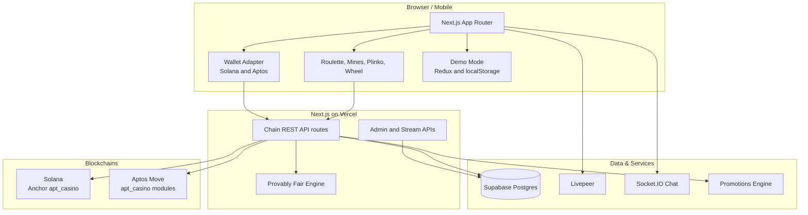
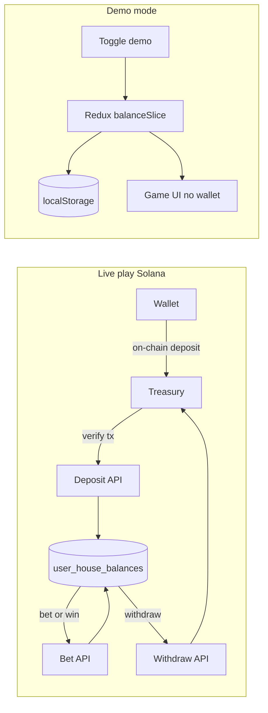
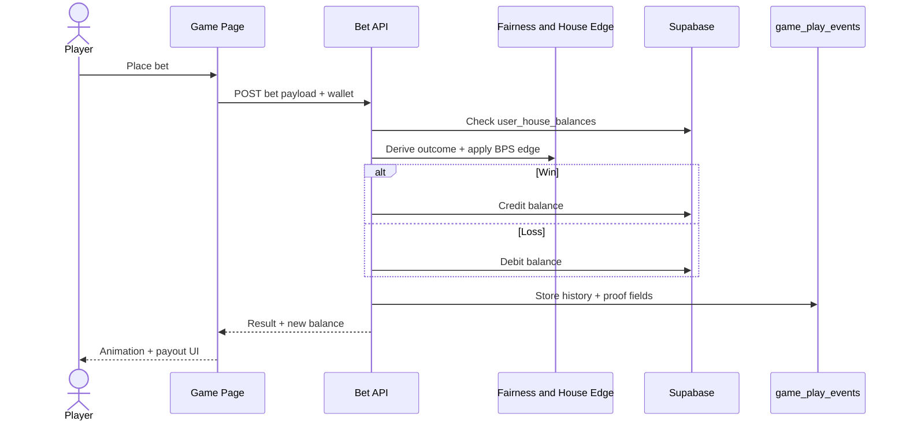
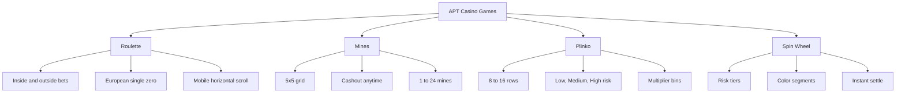
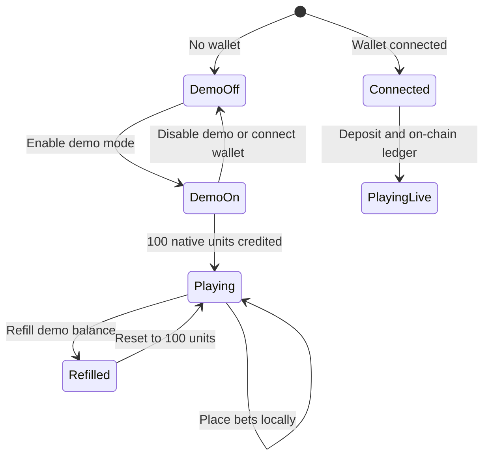
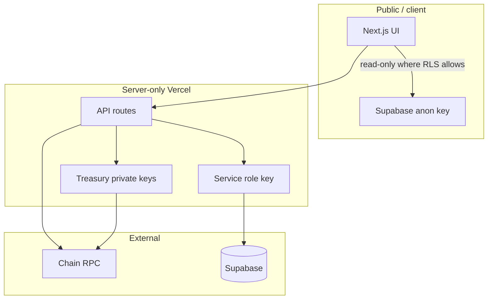

# APT-Casino -  Real-Time GambleFi as a Decentralized Probabilistic Compute Layer on Solana and Aptos

**Live:** [https://aptcasino.fun](https://aptcasino.fun) · **Litepaper:** [https://aptcasino.fun/litepaper](https://aptcasino.fun/litepaper)

A couple of days back, I was was on etherscan exploring some transactions and saw an advertisement of [https://stake.com/](url) which was giving 200% bonus on first deposit, I deposited 120 USDT into stake.com they gave 360 USDT as total balance in their controlled custodial wallet and when I started playing casino games I was shocked to see that I was only able to play with $1 per game and was unable to increase the betting amount beyond $1 coz and when I tried to explore and play other games on the platform the issue was persisting, I reached the customer support and got to know that this platform has cheated him under the name of wager limits as I was using the bonus scheme of 200%.

When I asked the customer support to withdraw money they showed a rule list of wager limit, which said that if I wanted to withdraw the deposited amount, then I have to play $12,300 worth of gameplay and this was a big shock for me, as I was explained a maths logic by their live support. Thereby, In the hope of getting the deposited money back, I played the different games of stake.com like roulette, mines, spin wheel, etc, the entire night and lost all the money.

I was very annoyed of that's how APT-Casino was born, which is a combination of gamefi and defi all in one platform where new web3 users can play games, perform gambling, but have a safe, secure, transparent platform that does not scam any of their users. Also, I wanted to address common issues in traditional gambling platforms.

## Problems

The traditional online gambling industry is plagued by several issues, including:
- **Unfair Game Outcomes:** 99% of platforms manipulate game results, leading to unfair play.

- **High Fees:** Users face exorbitant fees for deposits, withdrawals, and gameplay.

- **Restrictive Withdrawal Policies:** Withdrawal limits and conditions often prevent users from accessing their funds.

- **Bonus Drawbacks:** Misleading bonus schemes trap users with unrealistic wagering requirements.

- **Lack of True Asset Ownership:** Centralised platforms retain control over user assets, limiting their freedom and security.

- **User Adoption of Web2 users:** Bringing users to web3 and complexity of using wallet first time is kinda difficult for web2 users.

- **No Social Layer** → No live streaming, no community chat, no collaborative experience.  

## Solution

APT-Casino addresses these problems by offering:
- **Provably Fair Gaming:** Utilising on-chain randomness and verifiable outcomes on **Solana** and **Aptos**, ensuring game results are transparent and auditable.


- **Low Fees:** Leveraging efficient L1 blockchains to minimise transaction costs.

- **Flexible Withdrawal Policies:** Providing users with clearer access to their funds (with configurable platform fees documented in `.env.example`).

- **Transparent Bonus Schemes:** Clear and clean terms without hidden traps.

- **True Asset Ownership:** Decentralised asset management ensures users have full control over their assets.

- **Seamless wallet creation** Login via keyless login wallet which offers sign in option with GOOGLE and APPLE option + Petra Wallet (Aptos) and Solana wallet adapters.

- **Fully Gasless and Zero Requirement of Confirming Transactions:** Our Users does not require the user to pay gas fees, it's paid by our treasury address to approve a single transaction we do it all, they can just play as of they are playing in their web2 platforms.

- **Live Streaming Integration** → Built with **Livepeer**, enabling real-time game streams, tournaments, and live dealer interaction on `/live`.  

- **On-Chain Chat** → Socket.IO + wallet-signed messages ensure verifiable, real-time communication between players.  

- **ROI Share Links** → Every withdrawal (profit or loss) generates a **shareable proof-link** that renders a dynamic card (similar to Binance Futures PnL cards) when posted on X.  

- **Demo mode** → Play without connecting a wallet; default **100 native units** (e.g. 100 SOL) with one-click refill (`NEXT_PUBLIC_DEMO_START_NATIVE`).

- **Mobile-first web UI** → All four games (Roulette, Mines, Plinko, Spin Wheel) are usable on phone viewports; roulette uses a horizontal scroll table on small screens.


## Key Features

1. **On-Chain Randomness:** Provably fair outcomes on Solana and Aptos with verifiable proofs stored in Supabase when migrations are applied.
2. **Decentralized Asset Management:** Users retain full control over their funds through secure and transparent blockchain transactions.
3. **User-Friendly Interface:** An intuitive and secure interface for managing funds, placing bets, and interacting with games.
4. **Diverse Game Selection:** A variety of games, including roulette, mines, plinko, and spin wheel. As a (POC) Proof of Concept, developed 4 games but similar model can be applied to introduce new casino games to the platform.
5. **Seamless wallet creation** Login via our keyless login wallet which offers sign in option with GOOGLE and APPLE option + Petra Wallet.
6. **Fully Gasless and Zero Requirement of Confirming Transactions:** Our Users does not require the user to pay gas fees, it's paid by our treasury address to approve a single transaction we do it all, they can just play as of they are playing in their web2 platforms.
7. **Real-Time Updates**: Live game state and balance updates
8. **Event System**: Comprehensive event tracking for all game actions
9. **Social Layer** → Live streaming, on-chain chat, and NFT-based player profiles.
10. **Multichain play** → **Solana** is the default live chain; Aptos Move contracts and additional chains are registered in `src/lib/chains/registry.ts`.
11. **House balance ledger** → Supabase-backed `user_house_balances` with on-chain deposit/withdraw verification.
12. **Admin dashboard** → Ops tools for withdrawals, streams, bans, and analytics (server-gated).
13. **Promotions engine** → Admin-created coupon credits + deposit deals with audit logs and anti-abuse controls.
14. **KOL portal upgrades** → Self-service password reset and expanded earnings surfaces.
15. **$APTC public IPO** → Fixed-price SOL → APTC sale at [`/ipo`](https://aptcasino.fun/ipo) (split SOL collector + APTC distributor wallets, 3-level affiliates, 30d auto-stake @ 30% APY, Raydium post-sale).
16. **Provably fair verify** → On-site proof checker at [`/fairness/verify`](https://aptcasino.fun/fairness/verify).

## Technical Architecture


### System overview



### Play balance modes



### Bet lifecycle (sequence)



## Technology Stack

- **Solana Blockchain:** Primary live play chain (Anchor program in `solana-programs/`).

- **Aptos Blockchain:** Move modules in `move-contracts/` for roulette, mines, plinko, and wheel.

- **On-Chain Randomness / Provably Fair:** Verifiable game outcomes and proof links per chain.

- **Decentralized Wallet Integration:** Solana wallet adapter + Aptos (Petra / keyless).

- **Frontend** → Next.js 15 (App Router) + TailwindCSS + MUI for smooth, responsive UI.  

- **Backend** → Next.js API routes + Supabase (Postgres) for balances, history, admin.

- **Relayers** → Gasless UX powered by treasury-funded relayer infrastructure.  

- **Livepeer** → Live video streaming integrated for casino games & tournaments.  

- **Socket.IO** → Real-time on-chain chat with cryptographic message signing.  

- Next.js, Javascript, Tailwind CSS, Move, Anchor/Rust, Keyless login Wallet Aptos SDK, Petra Wallet.


## Future Plans

All though started as a idea but now we are thinking to carry forward as a business model and expand further.

- **Mainnet:** Project is configured for Solana mainnet-beta and Aptos mainnet.

- **User Testing:** Conducting extensive user testing to refine the platform.

- **Promoting the Product:** Marketing to attract a wider audience.

- **Mobile compatibility:** Responsive layouts shipped for all games; native Android/iOS apps remain on the roadmap.

- Introducing new games to the platform

- Integrate the AI capabilities used for generating NFT profiles to provide even more personalized and engaging user experiences.

- Explore additional DeFi features like staking, farming, yield strategies to offer more financial services within the platform.

- Enabling Developers to build more transparent games in our platform.

- Bringing in new monetization to compensate the casino games/ game creators.

**Be the biggest gamefi/ gambling / games hub centre of the gaming industry.**

## $APTC token (public IPO → Raydium)

APTC is the native GambleFi token — launching on **Solana via a fixed-price public IPO**, then trading on **Raydium**.

**Live sale UI:** [aptcasino.fun/ipo](https://aptcasino.fun/ipo)

- **25% public sale** (250M APTC) · **$100K raise** @ **$0.0004** · **LIVE now** through July 13, 2026
- **Deposit SOL → receive APTC** instantly · auto-staked **30 days @ 30% APY**
- **Split treasuries:** receive-only SOL collector + hot APTC distributor (see `.env.example`)
- **Oversubscription** accepted · queued until distributor inventory is topped up
- **Post-IPO** Raydium pool · Jupiter routing · DexScreener · **listings-first** treasury ops
- **0%** team / founder / VC allocation · **No wash volume · no fake FDV · no dumps**
- **3-level IPO affiliates** (3% / 1.5% / 0.5%) with a withdraw cliff

Full tokenomics: [docs/APTC_TOKENOMICS.md](./docs/APTC_TOKENOMICS.md) · live charts on [aptcasino.fun/#tokenomics](https://aptcasino.fun/#tokenomics).

```mermaid
flowchart LR
    PLAY[Casino play] --> GGR[GGR]
    GGR --> BUY[Jupiter / Raydium buyback]
    BUY --> BURN[Burn 50%]
    BUY --> STAKE[Stakers 35%]
    BUY --> TRES[Treasury 15%]
    BUYER[Buyer SOL] --> COLLECT[SOL collector]
    DIST[APTC distributor] --> BUYER
    COLLECT --> OPS[@aptcasinofun ops]
    REF[IPO referrals] --> APTC[APTC rewards]
    STK[/stake + IPO_30D] --> APTC
```

Required env (see `.env.example`):

```env
IPO_ENABLED=true
NEXT_PUBLIC_IPO_ENABLED=true
NEXT_PUBLIC_IPO_SOL_TREASURY=   # receive-only SOL collector
NEXT_PUBLIC_IPO_APTC_DISTRIBUTOR=  # hot wallet that sends APTC
IPO_TREASURY_SECRET_KEY=        # secret for distributor only — never commit
NEXT_PUBLIC_APTC_SOLANA_MINT=
```

### Games
- **Roulette**: Classic roulette with multiple bet types (numbers, colors, odds/evens, etc.)
- **Plinko**: Dropping balls to multipliers
- **Mines**: Reveal tiles to find gems while avoiding mines
- **Spin Wheel**: Risk-based wheel spinning with different multiplier segments

House edge overrides (basis points) are configurable per game via `NEXT_PUBLIC_HOUSE_EDGE_BPS_*` in `.env.example`.

### Game catalog



## 🎯 Game Mechanics

### Roulette
- **Bet Types**: Numbers (0-36), Colors (Red/Black), Odds/Evens, High/Low, Dozens, Columns, Split, Street, Corner, Line
- **Payouts**: 1:1 to 35:1 depending on bet type
- **Randomness**: Provably fair derivation with timestamp and transaction data
- **Mobile**: Full table in a ~920px horizontal scroll container on small screens

### Mines
- **Grid**: 5x5 grid (25 tiles)
- **Mines**: 1-24 mines per game
- **Reveal**: Click tiles to reveal gems or mines
- **Multiplier**: Increases as you reveal more tiles safely
- **Cashout**: Collect winnings at any time

### Spin Wheel
- **Risk Levels**: Low, Medium, High
- **Segments**: 6-10 segments based on risk
- **Multipliers**: 1.2x to 10x depending on risk level
- **Instant Results**: Immediate win/loss determination

### Plinko
- **High Multipliers:** Drop the balls in the pyramid and wait
- **Risk Levels**: Low, Medium, High
- **Instant Results**: Immediate win/loss determination

## 🔧 Development

### Frontend Development
```bash
# Copy env template
cp .env.example .env

# Install & start development server
npm install
npm run dev

# Build for production
npm run build

# Start production server
npm start

# Run linting
npm run lint
```

Open [http://localhost:3000](http://localhost:3000).

### Contract Development
```bash
# Aptos Move
npm run compile:aptos
npm run deploy:aptos -- mainnet   # or testnet
npm run bootstrap:aptos

# Solana Anchor
npm run compile:solana
npm run deploy:solana -- mainnet   # or devnet
npm run bootstrap:solana

# Supabase roadmap seed (optional)
npm run seed:roadmap
```

Legacy Aptos-only flow:
```bash
cd move-contracts
aptos move compile
aptos move test
node scripts/deploy.js mainnet
```

### Environment Variables

Copy `.env.example` to `.env`. Never commit `.env` (see root `.gitignore`).

Key groups:
- **Site** — `NEXT_PUBLIC_SITE_URL` (canonical origin, e.g. `https://aptcasino.fun`; litepaper at `/litepaper`), pitch deck / social URLs
- **Solana** — `NEXT_PUBLIC_SOLANA_NETWORK`, RPC, `NEXT_PUBLIC_SOL_TREASURY_ADDRESS`, `SOL_TREASURY_SECRET_KEY`, `NEXT_PUBLIC_APT_CASINO_PROGRAM_ID`
- **Aptos** — `NEXT_PUBLIC_APTOS_NETWORK`, `NEXT_PUBLIC_CASINO_MODULE_ADDRESS`, `TREASURY_PRIVATE_KEY`
- **Supabase** — `NEXT_PUBLIC_SUPABASE_URL`, `NEXT_PUBLIC_SUPABASE_ANON_KEY`, `SUPABASE_SERVICE_ROLE_KEY`
- **Demo** — `NEXT_PUBLIC_DEMO_START_NATIVE` (default `100` native units, e.g. 100 SOL)
- **House edge, fees, referrals, streaming, admin** — documented inline in `.env.example`

Minimal example:
```env
NEXT_PUBLIC_DEFAULT_PLAY_CHAIN=solana
NEXT_PUBLIC_SITE_URL=https://aptcasino.fun
NEXT_PUBLIC_SUPABASE_URL=
NEXT_PUBLIC_SUPABASE_ANON_KEY=
SUPABASE_SERVICE_ROLE_KEY=
NEXT_PUBLIC_SOL_TREASURY_ADDRESS=
SOL_TREASURY_SECRET_KEY=
NEXT_PUBLIC_APTOS_NETWORK=mainnet
NEXT_PUBLIC_CASINO_MODULE_ADDRESS=
TREASURY_PRIVATE_KEY=
NEXT_PUBLIC_LIVEPEER_API_KEY=
```

## 🚀 Deployment

### Vercel Deployment

1. **Connect to Vercel**
```bash
npm install -g vercel
vercel login
```

2. **Deploy**
```bash
vercel --prod
```

3. **Set Environment Variables**
In Vercel dashboard, copy all required keys from `.env.example`.

See also [mainnet.md](./mainnet.md), [move-contracts/README-DEPLOY.md](./move-contracts/README-DEPLOY.md), and [solana-programs/README-DEPLOY.md](./solana-programs/README-DEPLOY.md).

### Manual Deployment

1. **Build the application**
```bash
npm run build
```

2. **Deploy to your hosting provider**
Upload the `.next` folder and `public` folder to your hosting provider.

## Documentation

| File | Purpose |
|------|---------|
| [docs/APTC_TOKENOMICS.md](./docs/APTC_TOKENOMICS.md) | **$APTC** — public IPO → Raydium, allocation, GGR flywheel |
| [mainnet.md](./mainnet.md) | Mainnet launch checklist (multichain) |
| [deployment.md](./deployment.md) | Aptos module addresses & entry function reference |
| [liquidity.md](./liquidity.md) | Treasury, house balance, and fee flow |
| [docs/ADDING_A_CHAIN.md](./docs/ADDING_A_CHAIN.md) | How to add a new play chain |
| [docs/wheel-color-detector.md](./docs/wheel-color-detector.md) | Spin Wheel color detector component |
| [supabase/README.md](./supabase/README.md) | Database migrations |

## Demo mode

Enable demo play from the wallet menu without connecting a wallet. Starting balance defaults to **100** native units per chain (`NEXT_PUBLIC_DEMO_START_NATIVE`). Use **Refill demo balance** to reset. Demo state persists in `localStorage` per chain.



## 🔐 Security

### On-Chain Randomness
All games use verifiable randomness derived from:
- Block timestamp
- Transaction hash
- Player address
- Nonce values

### Provably Fair
- Game logic and proofs are auditable per chain
- Randomness is verifiable
- Supabase stores fairness proof fields when migrations are applied

### Smart Contract Security
- Reentrancy protection
- Input validation
- Proper error handling
- Event logging for transparency

### Operational
- Server routes hold treasury keys; never expose `TREASURY_PRIVATE_KEY` or `SOL_TREASURY_SECRET_KEY` to the client
- Withdrawals above thresholds may require manual approval (`WITHDRAW_APPROVAL_BEARER`)
- Review `BANNED_WALLET_ADDRESSES` and Supabase ban tables for compliance tooling

### Trust boundaries


