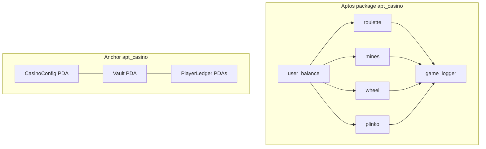
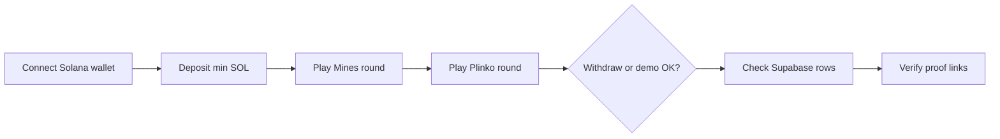

# Contract deployment reference

Last updated: 2026-07-10

On-chain integration details for APT Casino. For step-by-step publish commands see [move-contracts/README-DEPLOY.md](./move-contracts/README-DEPLOY.md) and [solana-programs/README-DEPLOY.md](./solana-programs/README-DEPLOY.md).

**$APTC public IPO** (off-chain settlement + SPL transfers) is documented in [docs/APTC_TOKENOMICS.md](./docs/APTC_TOKENOMICS.md) and configured via `IPO_*` / `NEXT_PUBLIC_IPO_*` in `.env.example`. Apply Supabase IPO migrations under `supabase/migrations/20260709*` before enabling sales in production.

## Package topology



## Aptos Move package

### Published module address

Replace with your publisher address after `npm run deploy:aptos`:

```
Module address (apt_casino): 0x421055ba162a1f697532e79ea9a6852422d311f0993eb880c75110218d7f52c0
```

| Module | Full name |
|--------|-----------|
| Roulette | `0x4210…f52c0::roulette` |
| Mines | `0x4210…f52c0::mines` |
| Wheel | `0x4210…f52c0::wheel` |
| Plinko | `0x4210…f52c0::plinko` |
| User balance | `0x4210…f52c0::user_balance` |

Set in `.env`:

```env
NEXT_PUBLIC_CASINO_MODULE_ADDRESS=0x4210…f52c0
NEXT_PUBLIC_TREASURY_ADDRESS=0x4210…f52c0
NEXT_PUBLIC_APTOS_NETWORK=mainnet
```

### Entry functions (frontend / relayer)

**Roulette**

- `roulette::deposit(user, amount, house_addr)`
- `roulette::request_withdraw(user, amount)`
- `roulette::admin_payout(admin, to, amount)`
- `roulette::user_place_bet(user, amount, bet_kind, bet_value)`
- `roulette::house_place_bet(admin, player, amount, bet_kind, bet_value)`

**Mines**

- `mines::deposit(user, amount, house_addr)`
- `mines::request_withdraw(user, amount)`
- `mines::admin_payout(admin, to, amount)`
- `mines::user_play(user, amount, pick)`
- `mines::house_play(admin, player, amount, pick)`

**Wheel**

- `wheel::deposit(user, amount, house_addr)`
- `wheel::request_withdraw(user, amount)`
- `wheel::admin_payout(admin, to, amount)`
- `wheel::user_spin(user, amount, sectors)`
- `wheel::house_spin(admin, player, amount, sectors)`

**Plinko**

- `plinko::deposit(user, amount, house_addr)`
- `plinko::request_withdraw(user, amount)`
- `plinko::admin_payout(admin, to, amount)`
- `plinko::user_plinko(user, amount, sectors)`
- `plinko::house_plinko(admin, player, amount, sectors)`

**User balance (shared ledger)**

- `user_balance::init` — bootstrap house resource (run via `npm run bootstrap:aptos`)

## Solana Anchor program

After `npm run deploy:solana`:

```env
NEXT_PUBLIC_APT_CASINO_PROGRAM_ID=<program_id>
SOL_TREASURY_SECRET_KEY=<admin_keypair>
NEXT_PUBLIC_SOL_TREASURY_ADDRESS=<vault_or_treasury_pubkey>
```

Instructions: `initialize`, `deposit`, `withdraw`, `admin_settle`, `log_game`, `set_paused`. Game type IDs: `1` Plinko, `2` Mines, `3` Roulette, `4` Wheel.

## Frontend deployment (Vercel)

```bash
npm run build
vercel --prod
```

Set all production env vars from `.env.example` in the Vercel project settings. Use `./deploy.sh -n mainnet -c` for contracts-only from the repo root.

## Post-deploy smoke test



1. Connect wallet (Solana)
2. Deposit minimum amount
3. Play one round each of Mines and Plinko
4. Request withdraw (or verify demo mode without wallet)
5. Confirm Supabase `user_house_balances` and game history rows update
6. Verify `/api/promotions/public` returns active campaigns after migration sync
