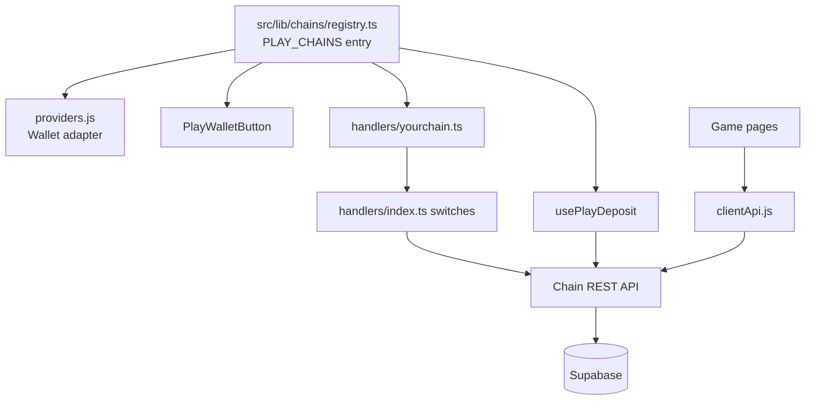
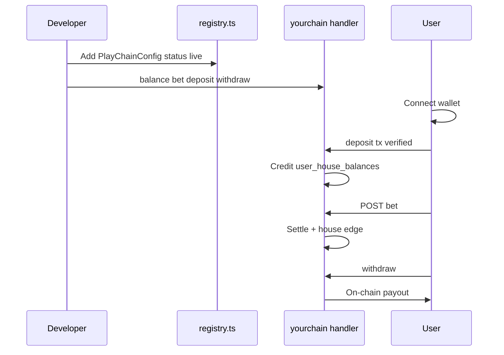

# Adding a new play chain

Last updated: 2026-05-27

Solana is the default (`NEXT_PUBLIC_DEFAULT_PLAY_CHAIN=solana`). New chains plug into the registry and shared API routes under `/api/chains/[chainId]/`.

## Integration map

## End-to-end sequence (new chain)

## 1. Registry (`src/lib/chains/registry.ts`)

Add a `PlayChainConfig` entry to `PLAY_CHAINS` with the appropriate `sortOrder` (lower = shown first in the navbar switcher).

| Field | Meaning |
|-------|---------|
| `status` | `'live'` when wallet + deposit + play are ready; `'coming_soon'` otherwise |
| `walletProvider` | `'solana' \| 'aptos' \| 'sui' \| 'near' \| 'starknet' \| 'stellar' \| 'tezos' \| 'evm'` |
| `balanceMode` | `'server'` = Supabase `user_house_balances` + chain API; `'client'` = Redux/local only |
| `units` | Raw multiplier (e.g. `1e9` lamports, `1e8` octas) |
| `treasuryPublicEnv` | Public env key for the deposit receive address |
| `feeWalletPublicEnv` | Public env key for platform fee wallet |

Set `DEFAULT_PLAY_CHAIN` only if the new chain should become the global default.

## 2. Wallet provider (`src/app/providers.js`)

Wrap the app with the chain’s wallet adapter (see `SolanaWalletProvider` for the pattern).

## 3. Connect UI

- `src/components/PlayWalletButton.js` — branch on `walletProvider`
- `src/hooks/usePlayWallet.js` — active address for the selected chain

## 4. Deposit hook (`src/hooks/usePlayDeposit.js`)

Implement `deposit()` for the new provider (build tx, confirm, call deposit API).

## 5. Server handlers (`src/lib/server/play/handlers/`)

Create `handlers/yourchain.ts` with:

- `yourchainBalanceGET(wallet)`
- `yourchainBetPOST(request)` — debit/credit `user_house_balances`
- `yourchainDepositPOST(request)` — verify on-chain tx, credit DB
- `yourchainWithdrawPOST(request)` — debit DB, payout on-chain

Register each in `handlers/index.ts` inside the `switch (chainId)` blocks.

Routes are automatic once handlers exist:

- `GET/POST /api/chains/[chainId]/balance`
- `POST /api/chains/[chainId]/bet`
- `POST /api/chains/[chainId]/deposit`
- `POST /api/chains/[chainId]/withdraw`

## 6. Client API

`src/lib/play/clientApi.js` already calls `/api/chains/${chainId}/…`. No change needed if handlers are registered.

## 7. Environment

Add treasury, RPC, and fee wallet keys to `.env.example` with comments. Document min deposit/withdraw env vars if applicable.

## 8. Optional legacy alias

Keep `/api/solana/*` as thin wrappers (see existing routes) if external tools depend on the old paths.

## Checklist

- [ ] Registry entry with correct `status` and `sortOrder`
- [ ] Env: treasury address + server payout key
- [ ] Wallet provider + connect button
- [ ] Server handlers + index switches
- [ ] Deposit flow in `usePlayDeposit`
- [ ] Game pages use `usePlayBalance` / `usePlayCurrency` (chain-aware)
- [ ] Smoke test: connect → deposit → bet one game → withdraw
- [ ] Verify chain path compatibility with promotions/deposit-deal bonus hooks
- [ ] Update [README.md](../README.md) and `.env.example`
