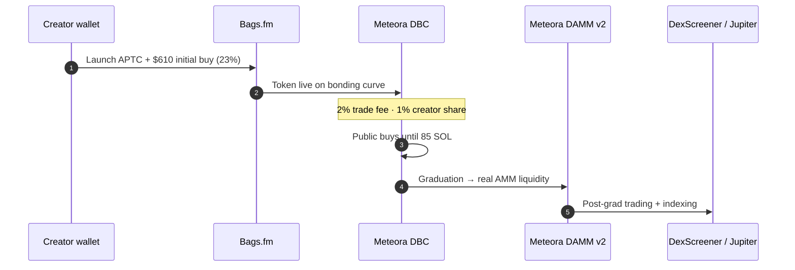
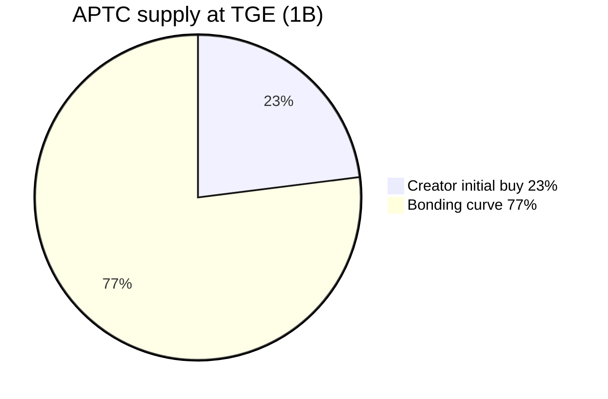

# APTC tokenomics

Last updated: 2026-06-19

Native SPL token for AptCasino.fun — fair launch on **Bags.fm** via **Meteora Dynamic Bonding Curve (DBC)**, graduating at **85 SOL** into **Meteora DAMM v2**.

## Token

| Field | Value |
|-------|--------|
| **Name** | AptCasino.fun |
| **Symbol** | APTC |
| **Chain** | Solana (SPL · Bags + Meteora) |
| **Mint** | Set at TGE → `NEXT_PUBLIC_APTC_SOLANA_MINT` |
| **Max supply** | 1,000,000,000 (9 decimals) |
| **Mint authority** | Revoked at creation |
| **Freeze authority** | Revoked at creation |
| **Token authority** | Bags Token Authority (standard Bags launch) |

## Launch (Bags.fm · Founder / Default mode)

| Parameter | Value |
|-----------|--------|
| **Platform** | [bags.fm/launch](https://bags.fm/launch) |
| **Curve** | Meteora DBC (virtual pool pre-graduation) |
| **Fee mode** | `DEFAULT` — Founder mode ([docs](https://docs.bags.fm/how-to-guides/customize-token-fees)) |
| **Trade fee** | 2% pre- and post-migration (1% protocol + 1% creator on curve) |
| **Creator initial buy** | **$610 → 23%** (~230M APTC) |
| **Public curve** | **77%** (~770M APTC) sold on bonding curve |
| **Graduation** | **85 SOL** raised → auto-migrate to Meteora DAMM v2 |
| **Fee share** | 100% → @aptcasinofun (operations wallet) |
| **Est. spot FDV at TGE** | ~$10k–$14k (after 23% creator buy) |
| **Est. average-cost FDV** | ~$2,650 ($610 ÷ 23%) |

## Supply allocation

| Bucket | % | Amount | Notes |
|--------|---|--------|-------|
| Creator initial buy | 23% | 230M | Single @aptcasinofun ops wallet · listings-first · 0% team/founder |
| Bonding curve (public) | 77% | 770M | Traded on Meteora DBC until graduation |

### Creator wallet deployment (230M · 23%)

Largest share funds **Tier 1, 2 & 3 listings** (DEX → aggregators → CEX). No wash volume. No fake FDV. No dumps.

| Use | % | Amount |
|-----|---|--------|
| Tier 1, 2 & 3 listings | 42% | 96.6M |
| Liquidity & market making | 22% | 50.6M |
| Community & player rewards | 18% | 41.4M |
| Staking emissions | 10% | 23M |
| Treasury & protocol ops | 8% | 18.4M |

**Tier 1** — Bags, Meteora, DexScreener, Jupiter, Birdeye, GeckoTerminal  
**Tier 2** — CoinGecko, CoinMarketCap  
**Tier 3** — CEX roadmap (MEXC, Gate.io, KuCoin, Bybit, OKX, Binance)

100% of Bags fee share also routes to @aptcasinofun for the same growth mandate.

There is **no Raydium-style LP burn**. At graduation, accumulated SOL and remaining curve inventory **seed the Meteora DAMM v2 pool**. Post-graduation, **25% of trade fees compound** back into pool liquidity.

## Fee economics (Default mode)

| Stage | Total fee | Creator (you) | Protocol | Compounding |
|-------|-----------|---------------|----------|-------------|
| Pre-migration (curve) | 2% | 1% | 1% | — |
| Post-migration (DAMM v2) | 2% | 0.75% | 0.75% | 0.5% into pool |

With **100% fee share to @aptcasinofun**, creator-side fees fund listings, liquidity, player rewards, staking, and protocol ops from a **single treasury wallet**. No team allocation. No founder allocation. No wash volume. No fake FDV. No dumps.

## Liquidity projections (post-graduation, illustrative)

| FDV | Est. DEX liquidity |
|-----|-------------------|
| $50k | ~$8k–$15k |
| $100k | ~$15k–$28k |
| $200k | ~$28k–$55k |

Liquidity grows with volume, price, and fee compounding — not fixed at TGE.

## GGR flywheel

30% of gross gaming revenue funds open-market APTC buybacks on **Jupiter / Meteora**. Split (configurable via env):

- Burn
- Staker rewards
- Treasury runway

See `/api/ggr/buyback` and litepaper § GGR.

## On-chain programs

| Program | ID |
|---------|-----|
| Meteora DBC | `dbcij3LWUppWqq96dh6gJWwBifmcGfLSB5D4DuSMaqN` |
| Meteora DAMM v2 | `cpamdpZCGKUy5JxQXB4dcpGPiikHawvSWAd6mEn1sGG` |
| Bags Fee Share V2 | `FEE2tBhCKAt7shrod19QttSVREUYPiyMzoku1mL1gqVK` |

## API & analytics

- **Bags API:** [docs.bags.fm/api-reference/introduction](https://docs.bags.fm/api-reference/introduction) — pools, lifetime fees, claim stats (homepage + tokenomics widget via `/api/staking/aptc-stats`)
- **Meteora DBC (on-chain):** bonding-curve SOL reserve + graduation progress (works without Bags API key)
- **DexScreener:** holders, MC, liquidity, volume, price changes
- **Env:** `BAGS_API_KEY` (from [dev.bags.fm](https://dev.bags.fm)) — optional but enables lifetime fees + claim stats

## Links

- **Website:** https://aptcasino.fun/
- **Launch:** https://bags.fm/launch
- **Stake:** https://aptcasino.fun/stake
- **Litepaper:** https://aptcasino.fun/litepaper
- **Reference Bags token:** [Bynomo on Solscan](https://solscan.io/token/Faw8wwB6MnyAm9xG3qeXgN1isk9agXBoaRZX9Ma8BAGS)
