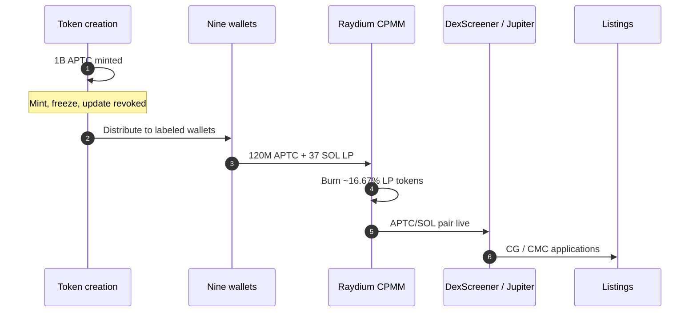
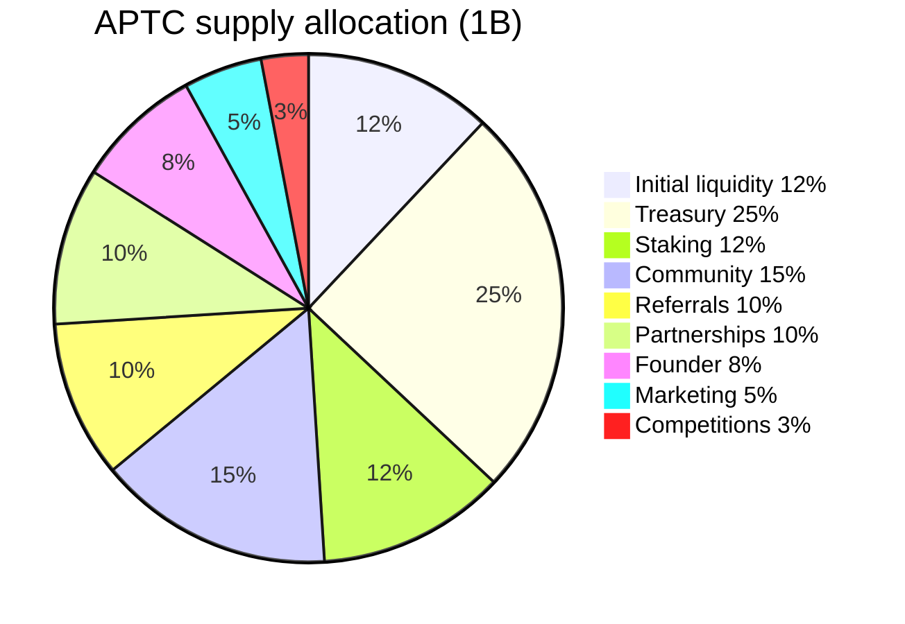
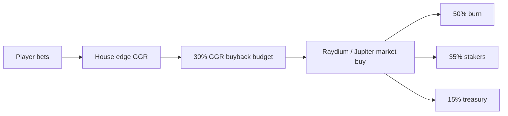

# APTC tokenomics

Last updated: 2026-06-08

Native SPL token for AptCasino.fun — live on Solana via Raydium CPMM.

## Token

| Field | Value |
|-------|--------|
| **Name** | AptCasino.fun |
| **Symbol** | APTC |
| **Chain** | Solana (SPL) |
| **Mint** | `AptCYjLJmZuWC6vWYfeZf7catWrhX9XCbiZir1PopNZU` |
| **Max supply** | 1,000,000,000 (6 decimals) |
| **Mint authority** | Revoked |
| **Freeze authority** | Revoked |
| **Update authority** | Revoked |

## Launch (Raydium CPMM)

| Parameter | Value |
|-----------|--------|
| **Pair** | APTC/SOL |
| **Venue** | Raydium Standard AMM (CPMM) |
| **LP seed** | 120M APTC + 37 SOL |
| **Fee tier** | 0.5% |
| **Approx liquidity** | ~$5,000 |
| **Approx launch MC** | ~$20,800 |
| **LP burn** | ~16.67% (~20M APTC + ~6.17 SOL locked) |

## Supply allocation (100%)

| Bucket | % | Amount |
|--------|---|--------|
| Initial liquidity | 12% | 120M |
| Treasury & operations | 25% | 250M |
| Staking rewards | 12% | 120M |
| Community & ambassadors | 15% | 150M |
| Referral rewards | 10% | 100M |
| Partnerships & ecosystem | 10% | 100M |
| Founder reserve | 8% | 80M |
| Marketing & launch | 5% | 50M |
| Competitions & airdrops | 3% | 30M |

## Wallet transparency

| Wallet | Amount | Address |
|--------|--------|---------|
| Liquidity | 120M | `CAVLQyCEycrok3Mbv5mdCbE3epGQW3ibQ447fwTLweYx` |
| Treasury | 250M | `77WBQZcjr1eLpYDk6PrwUbSUkLw57fNyX4U7pYqrrbHM` |
| Staking | 120M | `4Ka1vdinFUqhh3TtHaohj1MiKVUrvJBrgsVp1MfVnXFQ` |
| Community | 150M | `6o2MnFJkPsAcrd3aQwMLPvS7S3jLqoHufPVFpjnEemdU` |
| Referrals | 100M | `EuGB4qtHrCanacDktatYqiBGLcESBtomrE9o9vsf2PMC` |
| Partnerships | 100M | `hCs3cwHHjTJbCKDgFQdcDRGLZm9foDaKbJAmjme8uN8` |
| Founder reserve | 80M | `H19S7VBJweiiKhE3oFivrd43j7CAkJkWKHC2dHxDkBB` |
| Marketing | 50M | `2HuE97iCqtwJ1QaZofezzHNbgGbuoGbZA39JXgwpGWLn` |
| Competitions | 30M | `Cyrc6UZz1P4RqmMrmSSuYCSrzfu8w6TnYEAxGStdgHvq` |

## GGR buyback flywheel

Env-driven defaults — see `.env.example` (`GGR_*` vars).

## Listings roadmap

- **Raydium** — CPMM TGE + LP burn
- **DexScreener** — Enhanced Token Info
- **Jupiter** — Aggregated swap routing
- **CoinGecko** — Listing application
- **CoinMarketCap** — Listing application

## Related

- Site tokenomics: [aptcasino.fun/#tokenomics](https://aptcasino.fun/#tokenomics)
- Litepaper: [aptcasino.fun/litepaper](https://aptcasino.fun/litepaper)
- Config source: `src/lib/config/tokenomics.js`
