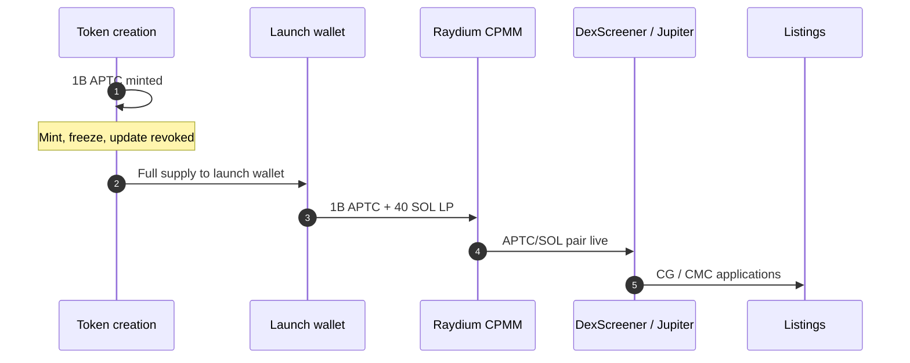
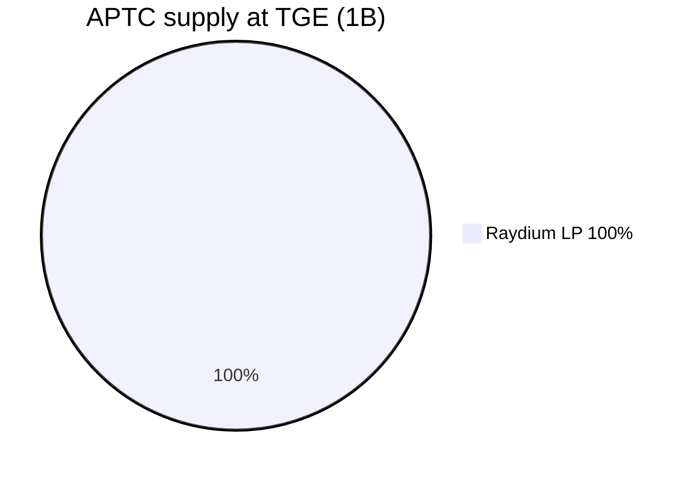

# APTC tokenomics

Last updated: 2026-06-15

Native SPL token for AptCasino.fun — live on Solana via Raydium CPMM fair launch.

## Token

| Field | Value |
|-------|--------|
| **Name** | AptCasino.fun |
| **Symbol** | APTC |
| **Chain** | Solana (SPL) |
| **Mint** | `ApTCoJG15om8W9gRpJJbdmG9JDBdF5ZJmiCf9F1RBRg` |
| **Raydium pair** | `C9ej1qVPj9tycKgWZSUkL9RDuz65VzX2WfG7rfhAqSaL` |
| **Max supply** | 1,000,000,000 (6 decimals) |
| **Mint authority** | Revoked |
| **Freeze authority** | Revoked |
| **Update authority** | Revoked |

## Launch (Raydium CPMM fair launch)

| Parameter | Value |
|-----------|--------|
| **Pair** | APTC/SOL |
| **Venue** | Raydium Standard AMM (CPMM) |
| **LP seed** | 1B APTC + 40 SOL |
| **Fee tier** | 0.5% |
| **Approx liquidity** | ~$5,408 |
| **Approx launch MC** | ~$2,704 |
| **Initial price** | ~$0.000002704 |

## Supply allocation (100%)

| Bucket | % | Amount |
|--------|---|--------|
| Raydium LP | 100% | 1B |

## Launch wallet

| Wallet | Amount | Address |
|--------|--------|---------|
| Launch & LP | 1B | `CAVLQyCEycrok3Mbv5mdCbE3epGQW3ibQ447fwTLweYx` |

## GGR flywheel

30% of gross gaming revenue funds open-market APTC buybacks on Raydium and Jupiter. Split (configurable via env):

- Burn
- Staker rewards
- Treasury runway

See `/api/ggr/buyback` and litepaper § GGR.

## Links

- **Website:** https://aptcasino.fun/
- **Stake:** https://aptcasino.fun/stake
- **Litepaper:** https://aptcasino.fun/litepaper
- **DexScreener:** https://dexscreener.com/solana/c9ej1qvpj9tyckgwzsukl9rduz65vzx2wfg7rfhaqsal
- **Solscan:** https://solscan.io/token/ApTCoJG15om8W9gRpJJbdmG9JDBdF5ZJmiCf9F1RBRg
