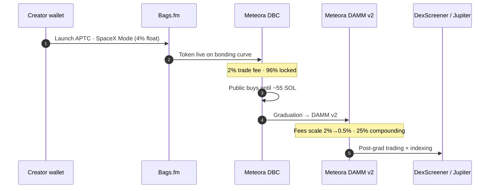
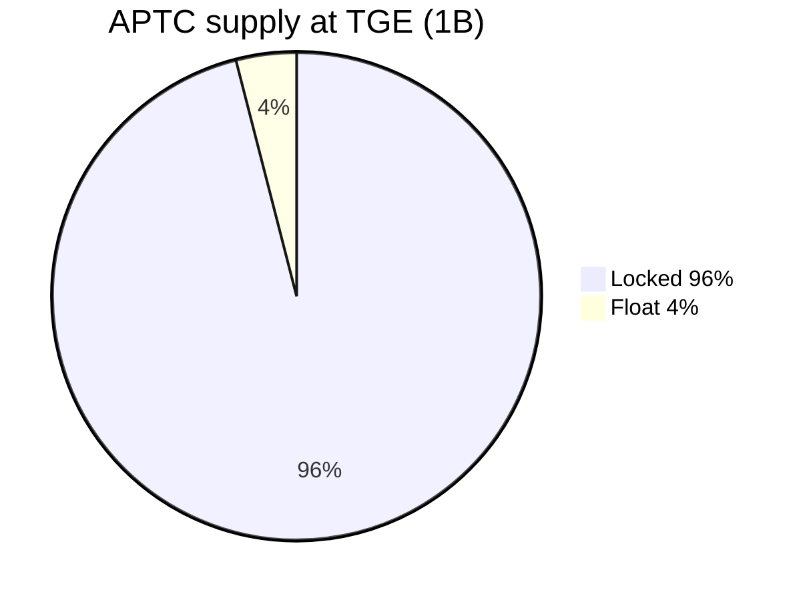

# APTC tokenomics

Last updated: 2026-06-19

Native SPL token for AptCasino.fun — fair launch on **Bags.fm** in **SpaceX Mode** via **Meteora Dynamic Bonding Curve (DBC)**, graduating at **~55 SOL** into **Meteora DAMM v2**.

## Token

| Field | Value |
|-------|--------|
| **Name** | AptCasino.fun |
| **Symbol** | APTC |
| **Chain** | Solana (SPL · Bags + Meteora) |
| **Mint** | Set at TGE → `NEXT_PUBLIC_APTC_SOLANA_MINT` |
| **Max supply** | 1,000,000,000 (9 decimals) |
| **Mint authority** | Revoked at creation |
| **Freeze authority** | Revoked at creation |
| **Token authority** | Bags Token Authority (standard Bags launch) |

## Launch (Bags.fm · SpaceX Mode)

SpaceX Mode is Bags’ default launch configuration modeled after the SpaceX IPO: **4% float**, **96% supply locked**, **dynamic fees (2% → 0.5%)**, and **25% post-migration fee compounding**.

| Parameter | Value |
|-----------|--------|
| **Platform** | [bags.fm/launch](https://bags.fm/launch) |
| **Fee mode** | SpaceX Mode — `2% Base with 96% Supply Locked` ([docs](https://docs.bags.fm/how-to-guides/customize-token-fees)) |
| **Config ID** | `ba28db46-ea6f-4452-8218-5587f6aca0a1` |
| **Float at TGE** | **4%** (~40M APTC circulating on curve) |
| **Locked supply** | **96%** (~960M APTC — Bags protocol lock, not a team wallet) |
| **Trade fee (pre-migration)** | **2%** (1% protocol + 1% creator on curve) |
| **Trade fee (post-migration)** | **2% → 0.5%** — scales down as market cap grows |
| **Fee compounding** | **25%** of post-migration fees compound after migration |
| **Creator initial buy** | **~$610** from the 4% float (listings-first @aptcasinofun) |
| **Graduation** | **~55 SOL** raised → auto-migrate to Meteora DAMM v2 |
| **Fee share** | 100% → @aptcasinofun (operations wallet) |
| **Starting market cap (target)** | **~$50k** on circulating float |
| **Implied FDV at TGE** | **~$1.25M** ($50k MC ÷ 4% float) |

## Supply allocation

| Bucket | % | Amount | Notes |
|--------|---|--------|-------|
| Locked supply | 96% | 960M | Bags SpaceX Mode protocol lock — not a team/founder wallet |
| Float at launch | 4% | 40M | Circulating on Meteora DBC until graduation |

### Creator wallet deployment (@aptcasinofun)

Largest share funds **Tier 1, 2 & 3 listings** (DEX → aggregators → CEX). No wash volume. No fake FDV. No dumps.

| Use | % of ops deployment |
|-----|---------------------|
| Tier 1, 2 & 3 listings | 50% |
| Community & player rewards | 26% |
| Staking emissions | 14% |
| Treasury & protocol ops | 10% |

**Tier 1** — Bags, Meteora, DexScreener, Jupiter, Birdeye, GeckoTerminal  
**Tier 2** — CoinGecko, CoinMarketCap  
**Tier 3** — CEX roadmap (MEXC, Gate.io, KuCoin, Bybit, OKX, Binance)

100% of Bags fee share also routes to @aptcasinofun for the same growth mandate.

## Fee economics (SpaceX Mode)

| Stage | Total fee | Behavior |
|-------|-----------|----------|
| Pre-migration (curve) | 2% | 1% creator + 1% protocol |
| Post-migration (DAMM v2) | 2% → 0.5% | Market-cap-based decay toward 0.5% floor |
| Post-migration compounding | 25% of fees | Reinvested per Bags SpaceX Mode after migration |

With **100% fee share to @aptcasinofun**, creator-side fees fund listings, player rewards, staking, and protocol ops from a **single treasury wallet**. No team allocation. No founder allocation. No wash volume. No fake FDV. No dumps.

## GGR flywheel

30% of gross gaming revenue funds open-market APTC buybacks on **Jupiter / Meteora**. Split (configurable via env):

- Burn
- Staker rewards
- Treasury runway

See `/api/ggr/buyback` and litepaper § GGR.

## On-chain programs

| Program | ID |
|---------|-----|
| Meteora DBC | `dbcij3LWUppWqq96dh6gJWwBifmcGfLSB5D4DuSMaqN` |
| Meteora DAMM v2 | `cpamdpZCGKUy5JxQXB4dcpGPiikHawvSWAd6mEn1sGG` |
| Bags Fee Share V2 | `FEE2tBhCKAt7shrod19QttSVREUYPiyMzoku1mL1gqVK` |

## API & analytics

- **Bags API:** [docs.bags.fm/api-reference/introduction](https://docs.bags.fm/api-reference/introduction) — pools, lifetime fees, claim stats (homepage + tokenomics widget via `/api/staking/aptc-stats`)
- **Meteora DBC (on-chain):** bonding-curve SOL reserve + graduation progress (works without Bags API key)
- **DexScreener:** holders, MC, volume, price changes
- **Env:** `BAGS_API_KEY` (from [dev.bags.fm](https://dev.bags.fm)) — optional but enables lifetime fees + claim stats

## Links

- **Website:** https://aptcasino.fun/
- **Launch:** https://bags.fm/launch
- **Stake:** https://aptcasino.fun/stake
- **Litepaper:** https://aptcasino.fun/litepaper
- **Bags fee modes:** https://docs.bags.fm/how-to-guides/customize-token-fees
