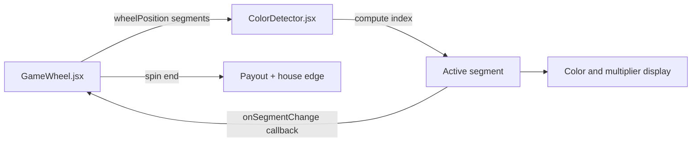
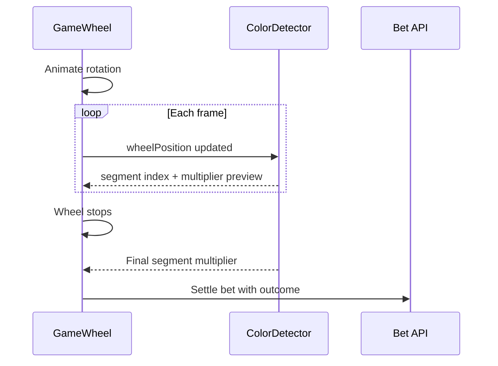

# Wheel color detector

Last updated: 2026-05-27

Component used by the Spin Wheel game to show which segment sits under the pointer and which multiplier applies.

## Component flow

## Location

- `src/components/wheel/ColorDetector.jsx`
- Consumed by `src/components/wheel/GameWheel.jsx`

## Behavior

1. Reads current wheel rotation and segment definitions
2. Computes the active segment index under the spinner
3. Displays segment color and multiplier
4. Notifies parent via callback when the segment changes

## Integration (`GameWheel`)

The wheel parent passes:

- `wheelPosition` — current rotation (degrees or normalized)
- `wheelData` / `segments` — segment colors and multiplier values

On spin end, the final multiplier comes from the segment under the pointer.

## Multiplier mapping

Each segment color maps to a fixed multiplier for the selected risk level (Low / Medium / High). Multipliers update while the wheel animates; the settled result uses the segment at rest.

## Usage

Do not mount `ColorDetector` standalone in pages — always use it through `GameWheel`, which owns spin state and payout logic.

## Mobile

The wheel game uses the same responsive page padding as Plinko and Mines (`pb-*` on the game page) so fixed controls and live chat do not cover the wheel or bet panel.

## Related

- House edge: `NEXT_PUBLIC_HOUSE_EDGE_BPS_WHEEL` in `.env.example`
- Game config: `src/app/game/wheel/` page and config modules
