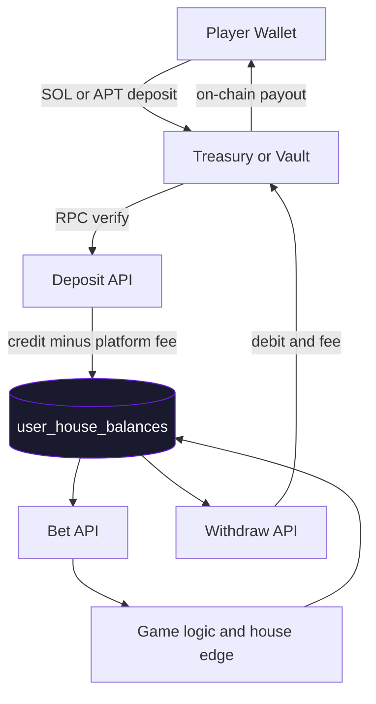
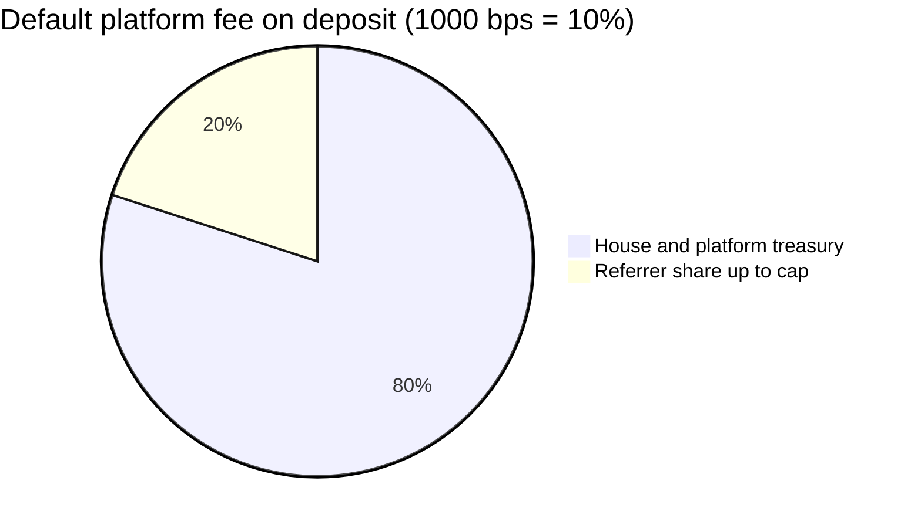
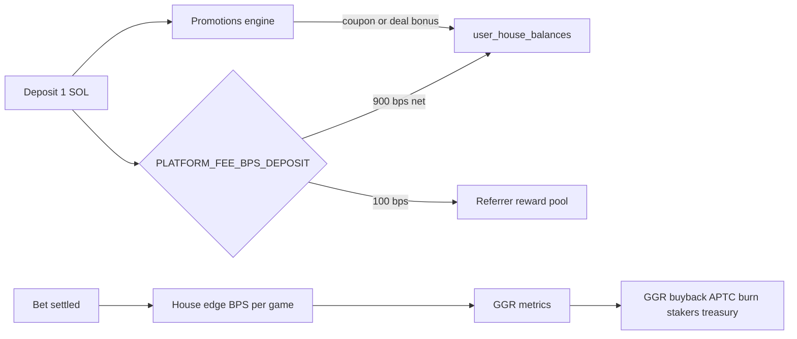
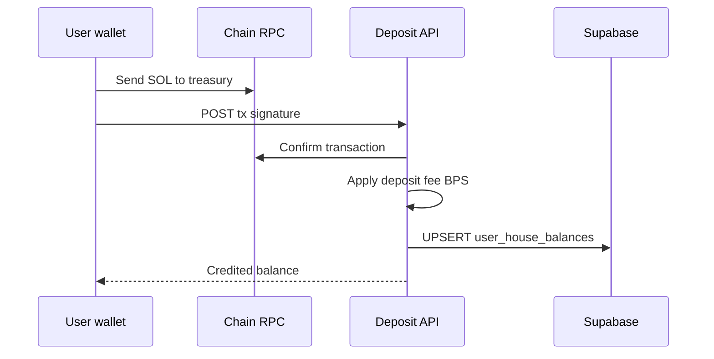
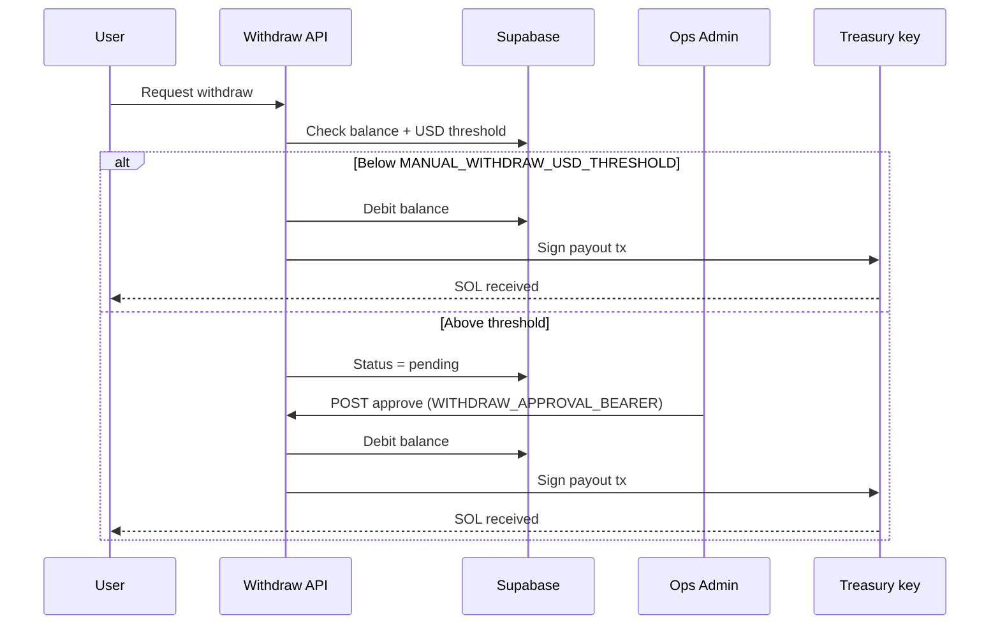
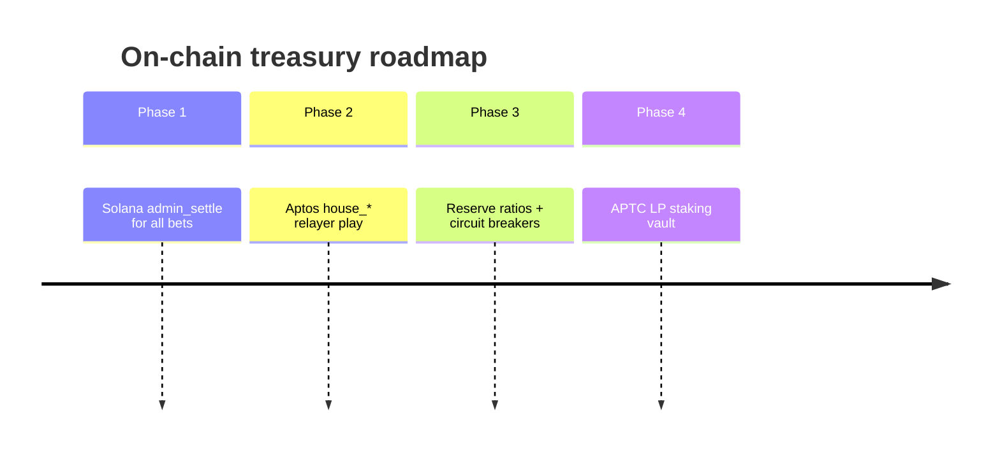
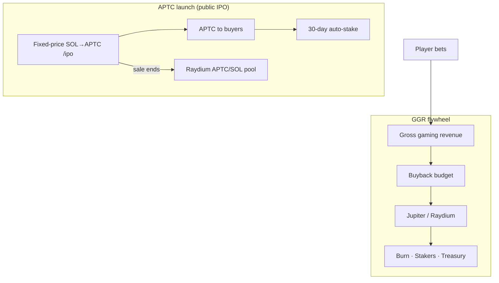

# Liquidity & treasury

Last updated: 2026-06-20

How player funds, house edge, and payouts flow in the current APT Casino stack.

## Architecture (today)



<details>
<summary>ASCII equivalent</summary>

```
Player wallet
    │ deposit (on-chain tx)
    ▼
Treasury / vault (Solana hot wallet or Aptos module)
    │ verified by API
    ▼
Supabase user_house_balances  ← in-app play balance
    │ bet / win via /api/chains/[chain]/bet
    ▼
Game outcome + house edge applied in app layer
    │ withdraw request
    ▼
Treasury payout (on-chain) after debit in DB
```

</details>

The web app does **not** use a purely client-side fake balance for Solana play. Balances live in Supabase (`user_house_balances`) and are updated by server handlers in `src/lib/server/play/handlers/`.

**Demo mode** is separate: local Redux + `localStorage` credits for users who enable demo without a wallet (default 100 native units; refill resets to `NEXT_PUBLIC_DEMO_START_NATIVE`).

## Revenue: house edge & platform fees

| Mechanism | Where |
|-----------|--------|
| **Natural roulette edge** | Single-zero wheel (~2.7%) |
| **Configurable BPS** | `NEXT_PUBLIC_HOUSE_EDGE_BPS_*` per game |
| **Deposit fee** | `PLATFORM_FEE_BPS_DEPOSIT` (default 10%) |
| **Withdraw fee** | `PLATFORM_FEE_BPS_WITHDRAW` (default 10%) |
| **Referrer share** | `REFERRER_FEE_SHARE_BPS_OF_DEPOSIT` (capped by deposit fee) |
| **GGR buyback** | `GGR_*` env vars → APTC burn / stakers / treasury |
| **Promotions rewards** | Coupon SOL credits + deposit-deal APTC boosts |

House edge is applied in app logic via `applyHouseEdgeToMultiplier()` (`src/lib/houseEdge.js`).

### Fee & revenue split





### Deposit sequence



### Withdraw sequence (with manual approval)



## Solana path

- Deposits: user sends SOL to treasury address (or program vault when fully wired)
- Play: `/api/chains/solana/bet` adjusts Supabase balance
- Withdraw: `/api/chains/solana/withdraw` debits DB and sends SOL from treasury keypair
- Optional on-chain: Anchor `admin_settle` / `log_game` for audit (`solana-programs/`)

Env: `NEXT_PUBLIC_SOL_TREASURY_ADDRESS`, `SOL_TREASURY_SECRET_KEY`, `SOLANA_MIN_WITHDRAW_SOL`.

## Aptos path

- Move modules handle deposit, bet, and payout entry functions (see [deployment.md](./deployment.md))
- Registry currently marks Aptos as `coming_soon` until wallet + server path are fully live
- Treasury EOA: `TREASURY_PRIVATE_KEY` signs `admin_payout` and relayer txs

## Liquidity requirements

Maintain enough native token in treasury to cover:

1. **Open exposure** — max plausible concurrent player winnings
2. **Withdraw queue** — pending manual approvals above `MANUAL_WITHDRAW_USD_THRESHOLD`
3. **Gas / fees** — relayer and payout transaction costs

Monitor via admin dashboard and Supabase views on balances and withdrawal requests.

## Future: pooled on-chain treasury

The Move `treasury` module sketched in earlier design docs (per-game pools, dynamic edge, reserves) is a **roadmap** enhancement. Today’s production path is **treasury EOA + Supabase ledger + configurable BPS**.

Phased rollout if moving more on-chain:



1. Solana program `admin_settle` for all bet settlement
2. Aptos `house_*` entry functions for gasless play via relayer
3. On-chain reserve ratios and circuit breakers
4. Liquidity provider staking (APTC staking vault on Solana — see Bank page env)

## Risk controls

- Manual withdraw approval for large USD-equivalent amounts
- Wallet ban list (`BANNED_WALLET_ADDRESSES` + Supabase ban migration)
- Solana program pause instruction
- Platform fee wallets separate from player payout treasury where possible

## APTC on Raydium (token trading)

APTC/SOL trades on **Raydium** after the public IPO closes — separate from player SOL/APT casino treasury balances.



See [docs/APTC_TOKENOMICS.md](./docs/APTC_TOKENOMICS.md) for IPO parameters and listing-tier economics.

## Related docs

- [mainnet.md](./mainnet.md) — launch checklist
- [deployment.md](./deployment.md) — contract addresses & functions
- `.env.example` — all fee and threshold variables
