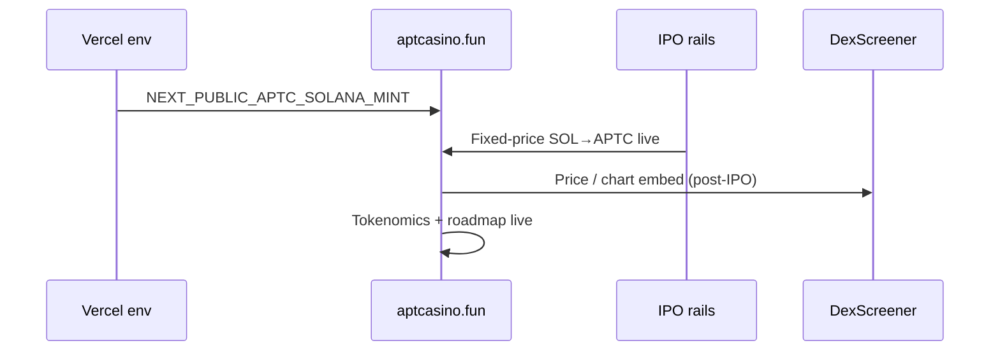
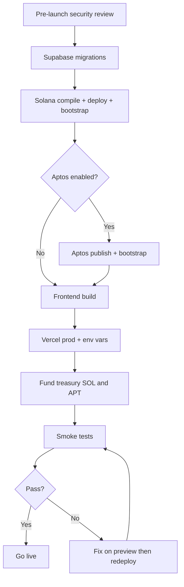
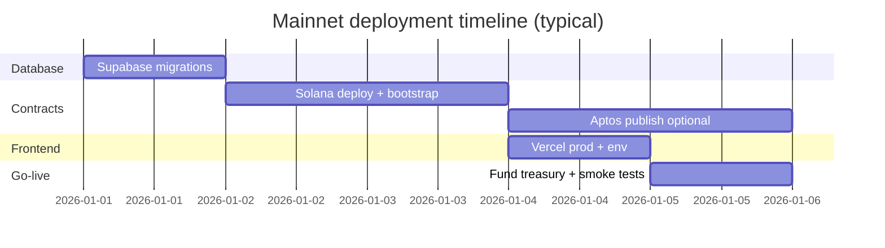
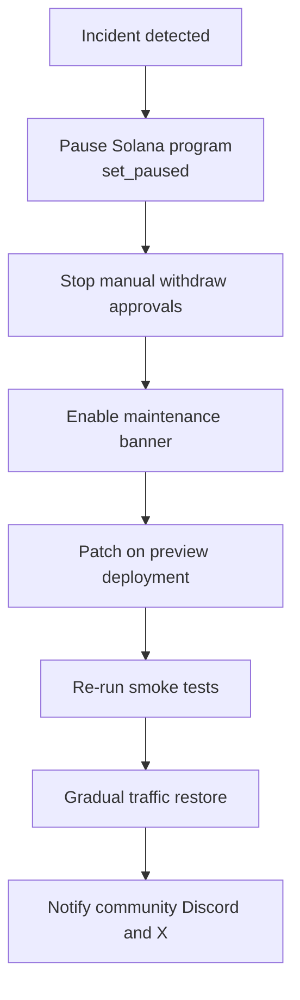

# Mainnet deployment guide

Last updated: 2026-06-19

Checklist for launching APT Casino on production infrastructure. Solana is the primary live chain; Aptos modules can run in parallel when `NEXT_PUBLIC_CASINO_MODULE_ADDRESS` is set and Aptos is marked `live` in the chain registry.

## APTC token (public IPO → Raydium)

- [ ] Open `/ipo` fixed-price sale — **250M APTC** · **$100K** raise @ **$0.0004**
- [ ] Confirm SOL collector + APTC distributor wallets (split hot/cold)
- [ ] Publish transparency pledge: **no wash volume · no fake FDV · no dumps** on site + litepaper
- [ ] Set `NEXT_PUBLIC_APTC_SOLANA_MINT` in `.env` / Vercel production
- [ ] Set `NEXT_PUBLIC_APTC_DEXSCREENER_PAIR` once DexScreener indexes the Raydium pair
- [ ] Post-IPO Raydium APTC/SOL pool live
- [ ] DexScreener Enhanced Token Info submitted
- [ ] Jupiter routing visible
- [ ] CoinGecko & CoinMarketCap applications submitted
- [ ] Enable staking: `APTC_STAKING_ENABLED=true` · configure `NEXT_PUBLIC_APTC_STAKING_VAULT`



See [docs/APTC_TOKENOMICS.md](./docs/APTC_TOKENOMICS.md) for full launch parameters.

## Launch pipeline



## Pre-launch

### Security

- [ ] Treasury keys stored only in server env (Vercel secrets), never in git
- [ ] `WITHDRAW_APPROVAL_BEARER` and `DASHBOARD_ADMIN_TOKEN` rotated and unique
- [ ] Supabase RLS reviewed; service role used only on API routes
- [ ] Solana program admin keypair backed up offline
- [ ] Aptos deployer / treasury key backed up offline
- [ ] Emergency pause tested on Solana program (`set_paused`)

### Infrastructure

- [ ] Supabase migrations applied (`supabase/README.md`)
- [ ] `.env.example` copied to Vercel with all required keys
- [ ] `NEXT_PUBLIC_SITE_URL` set to `https://aptcasino.fun` (litepaper: `https://aptcasino.fun/litepaper`)
- [ ] Solana RPC URL (paid provider recommended for mainnet)
- [ ] Livepeer API key for `/live` streams
- [ ] Promotions env and migration checks complete (`promo_campaigns`, coupon/deal APIs)

### Legal & product

- [ ] Terms, privacy, and responsible gaming copy reviewed
- [ ] Jurisdiction and licensing requirements assessed
- [ ] Manual withdrawal workflow documented for ops

## Environment (production)

Minimal set — see `.env.example` for the full list:

```env
NEXT_PUBLIC_SITE_URL=https://aptcasino.fun
NEXT_PUBLIC_DEFAULT_PLAY_CHAIN=solana

# Solana
NEXT_PUBLIC_SOLANA_NETWORK=mainnet-beta
NEXT_PUBLIC_SOLANA_RPC_URL=
SOLANA_RPC_URL=
NEXT_PUBLIC_SOL_TREASURY_ADDRESS=
SOL_TREASURY_SECRET_KEY=
NEXT_PUBLIC_APT_CASINO_PROGRAM_ID=

# APTC (public IPO → Raydium)
NEXT_PUBLIC_APTC_SOLANA_MINT=
NEXT_PUBLIC_APTC_DEXSCREENER_PAIR=

# Supabase
NEXT_PUBLIC_SUPABASE_URL=
NEXT_PUBLIC_SUPABASE_ANON_KEY=
SUPABASE_SERVICE_ROLE_KEY=

# Aptos (when live)
NEXT_PUBLIC_APTOS_NETWORK=mainnet
NEXT_PUBLIC_CASINO_MODULE_ADDRESS=
TREASURY_PRIVATE_KEY=
```

## Deployment steps



### 1. Database

```bash
npx supabase link --project-ref YOUR_PROJECT_REF
npx supabase db push
# or run migrations manually in SQL Editor — see supabase/README.md
npm run seed:roadmap   # optional
```

### 2. Solana program

```bash
npm run compile:solana
npm run deploy:solana -- mainnet
npm run bootstrap:solana
```

Record `NEXT_PUBLIC_APT_CASINO_PROGRAM_ID` from script output.

### 3. Aptos modules (optional)

```bash
npm run compile:aptos
npm run deploy:aptos -- mainnet
npm run bootstrap:aptos
```

Record `NEXT_PUBLIC_CASINO_MODULE_ADDRESS`.

### 4. Frontend

```bash
npm run build
vercel --prod
```

Or use `./deploy.sh -n mainnet` for combined contract + Vercel flow.

### 5. Fund treasury

- Seed Solana vault / treasury with enough SOL for payouts and fees
- Fund Aptos treasury EOA if Aptos play is enabled
- Set deposit/withdraw mins in env (`SOLANA_MIN_WITHDRAW_SOL`, etc.)

## Post-launch monitoring (first 72 hours)

- [ ] Deposits credit `user_house_balances`
- [ ] Bets debit/credit correctly on win/loss
- [ ] Withdrawals complete or enter pending + approval flow
- [ ] Game history and provably fair proof links work
- [ ] Promotions flow works end-to-end (admin create/stop/delete, user claim/deposit boost)
- [ ] Mobile layouts verified on iOS Safari and Android Chrome
- [ ] Demo mode refill shows 100 native units (or `NEXT_PUBLIC_DEMO_START_NATIVE`)
- [ ] Error rate and latency in Vercel logs acceptable
- [ ] IPO raise progress toward $100K target
- [ ] Post-IPO Raydium pool + DexScreener indexing

## Rollback



1. Enable maintenance banner or pause Solana program (`set_paused`)
2. Stop processing withdrawals from admin dashboard
3. Fix forward on a preview deployment; promote when stable
4. Communicate status via Discord / X links from env

## Cost estimates

| Item | Rough range |
|------|-------------|
| Aptos module publish | tens of APT (gas + package size) |
| Solana program deploy | ~1–3 SOL + rent |
| Public IPO ops | SOL collector + APTC distributor fee SOL |
| Vercel Pro | per plan |
| Supabase Pro | per plan |
| Livepeer / RPC | usage-based |

Update this document after each mainnet release with actual addresses and dates.
