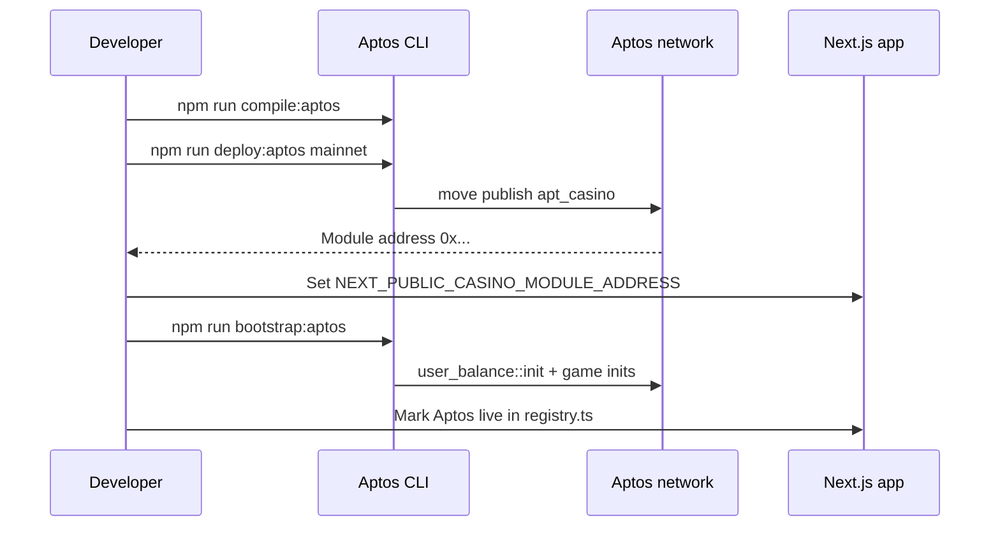

# Aptos Move — compile & publish

Last updated: 2026-06-19

Move package for roulette, mines, plinko, wheel, and shared `user_balance` / `game_logger` modules.

## Security — redeploy required (2026-06)

Mainnet modules published **before 2026-06-19** may expose:

- `user_balance::add_winnings_with_signer` (no auth) — **removed**; use `admin_add_winnings` or friend `add_winnings` only
- `mines::cashout` (caller-supplied payout) — **deprecated**; use `admin_settle_mines`
- `user_balance::withdraw` without APT transfer — replaced by `request_withdraw` + `admin_fulfill_withdraw`
- `plinko::GameSession` leak on repeat play — fixed via `move_from` cleanup

**Action:** Republish this package to Aptos mainnet after review. Until then, **do not route production play through Move modules** — the live app uses Supabase house balances + server payout verification.

## Deploy sequence



## Prerequisites

- [Aptos CLI](https://aptos.dev/tools/aptos-cli) (`aptos --version`)
- Repo root `.env` with `DEPLOYER_PRIVATE_KEY` (hex with or without `0x`, or AIP-80 `ed25519-priv-0x…`)
- **Mainnet:** fund the deployer account with enough APT (gas + publish; package size varies)

## Named address

`Move.toml` uses `apt_casino = "_"`. At compile/publish time it resolves to the **publisher account** from `DEPLOYER_PRIVATE_KEY` (same `0x…` address on every network).

## Commands (from repo root)

```bash
# Compile only
npm run compile:aptos

# Publish to mainnet
npm run deploy:aptos -- mainnet

# Publish to testnet
npm run deploy:aptos -- testnet
```

Direct script:

```bash
node move-contracts/scripts/deploy-aptos.mjs mainnet
```

If publish fails on package size or gas, retry chunked publish:

```bash
APTOS_CHUNKED_PUBLISH=1 node move-contracts/scripts/deploy-aptos.mjs mainnet
```

## After publish

1. Script prints `NEXT_PUBLIC_CASINO_MODULE_ADDRESS=…` — copy to `.env` and Vercel.
2. **`NEXT_PUBLIC_TREASURY_ADDRESS`** is usually the **same** as the module address (publisher = `apt_casino`).
3. Set `NEXT_PUBLIC_APTOS_NETWORK=mainnet`.
4. Set `TREASURY_PRIVATE_KEY` to the publisher key when the treasury EOA is the deployer (required for `/api/init-house`, payouts, `game_logger`).
5. Bootstrap on-chain `House` resources (idempotent):

```bash
npm run bootstrap:aptos
```

Runs `user_balance::init` plus game module inits when missing. `game_logger::GameLog` is created on first Aptos `/api/log-game` call if absent.

6. Mark Aptos `status: 'live'` in `src/lib/chains/registry.ts` when the app wallet + API path are ready.

## Full stack script

```bash
./deploy.sh -n mainnet -c
```

`-c` = contracts only (compile + publish). Omit `-c` to also run `npm install` + Vercel prod deploy.

## Reference

- Entry function list: [deployment.md](../deployment.md)
- Mainnet checklist: [mainnet.md](../mainnet.md)
