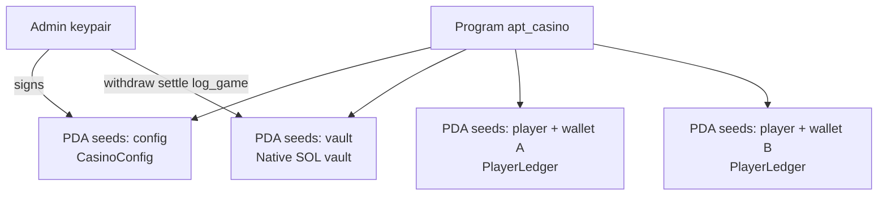
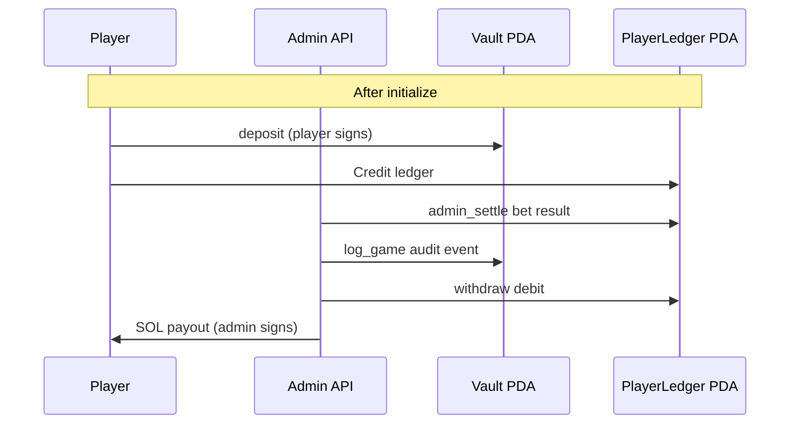
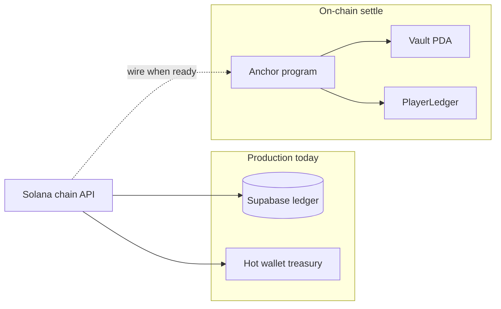

# Solana program — APT Casino (`apt_casino`)

Last updated: 2026-05-27

Anchor program alongside `move-contracts/`. Mirrors Aptos **`user_balance`** (vault + per-player ledger) and **`game_logger`** (on-chain audit events).

**Production status (2026-06):** The Anchor program is **not deployed to Solana mainnet**. Live play uses **custodial house balances** in Supabase: deposits/withdrawals hit treasury EOAs; bets settle server-side with `GAME_PAYOUT_VERIFICATION_REQUIRED`. Deploy this program only when migrating custody on-chain — do not market “on-chain Solana games” until then.

## Account layout (PDAs)



## Instruction flow (target integration)



## Prerequisites

- [Rust](https://rustup.rs/) + `cargo`
- [Solana CLI](https://docs.solanalabs.com/cli/install) (`solana --version`)
- [Anchor](https://www.anchor-lang.com/docs/installation) **0.30.1** (`anchor --version`)
- Funded deployer keypair (`~/.config/solana/id.json` or `SOL_TREASURY_SECRET_KEY` in `.env`)

## Program instructions

| Instruction | Signer | Purpose |
|-------------|--------|---------|
| `initialize` | Admin | Create config + vault PDAs |
| `deposit` | Player | SOL → vault, credit player ledger |
| `withdraw` | Admin | Debit ledger, SOL vault → player |
| `admin_settle` | Admin | Ledger debit/credit for server-side bets |
| `log_game` | Admin | Emit `GamePlayedEvent` (audit / fairness ref) |
| `set_paused` | Admin | Emergency pause |

## Commands (from repo root)

```bash
# Build program + IDL
npm run compile:solana

# Deploy to devnet (default cluster in Anchor.toml)
npm run deploy:solana -- devnet

# Deploy to mainnet-beta
npm run deploy:solana -- mainnet

# Initialize on-chain config (after deploy)
npm run bootstrap:solana
```

## After deploy

1. Script prints `NEXT_PUBLIC_APT_CASINO_PROGRAM_ID=…` — add to `.env` and Vercel.
2. `SOL_TREASURY_SECRET_KEY` must be the **admin** that calls `initialize`, `withdraw`, `admin_settle`, and `log_game`.
3. Set `NEXT_PUBLIC_SOL_TREASURY_ADDRESS` to the vault PDA or hot wallet used for deposits (see `getCasinoVaultPda()` in `src/lib/solana/program.ts`).
4. Configure `NEXT_PUBLIC_SOLANA_NETWORK=mainnet-beta` and RPC URLs in `.env`.

## PDAs

| Seed | Account |
|------|---------|
| `config` | `CasinoConfig` (admin, counters, pause flag) |
| `vault` | Native SOL vault |
| `player` + wallet | `PlayerLedger` (lamports balance) |

## Game type constants (match Aptos)

| ID | Game |
|----|------|
| 1 | Plinko |
| 2 | Mines |
| 3 | Roulette |
| 4 | Wheel |

## Integration status



| Layer | Status |
|-------|--------|
| Program in repo | Deployable |
| Live app play | Supabase house ledger + treasury hot wallet |
| Full on-chain settle | Wire Solana chain API and log-game routes to program instructions when ready |

## Reference

- Liquidity flow: [liquidity.md](../liquidity.md)
- Mainnet checklist: [mainnet.md](../mainnet.md)
- Env vars: `.env.example` (Solana section)
