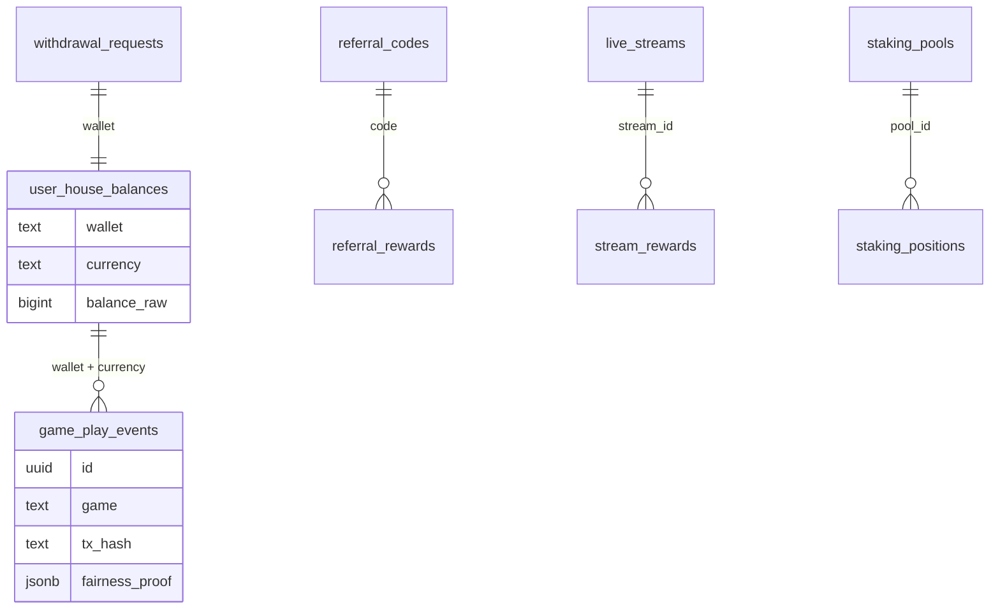
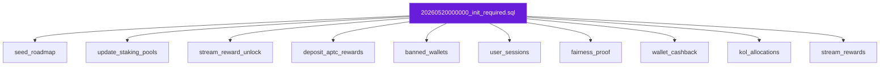

# Supabase migrations

Database schema for house balances, game history, referrals, staking, streams, admin, and compliance features.

## Schema overview



## Migration order



## Brand-new database

Run migrations in filename order. Easiest path:

```bash
npx supabase link --project-ref YOUR_PROJECT_REF
npx supabase db push
```

Or paste into Supabase → **SQL Editor** one file at a time from `migrations/`.

### Core

| File | Purpose |
|------|---------|
| `20260520000000_init_required.sql` | All base tables, views, staking pools, referrals, OTC lottery |

### Follow-ups (run if not already applied)

| File | When you need it |
|------|------------------|
| `20260520120000_seed_roadmap.sql` | Roadmap page empty (or `npm run seed:roadmap`) |
| `20260520130000_update_staking_pools.sql` | `/stake` min stake still shows `1` APTC instead of supply % |
| `20260520130500_clear_roadmap_dates.sql` | Optional — clear ETA dates on roadmap rows |
| `20260520140000_remove_aptos_grant_roadmap_item.sql` | Optional — remove Aptos grant roadmap row |
| `20260520150000_stream_reward_unlock.sql` | Stream reward unlock rules |
| `20260520160000_deposit_aptc_rewards.sql` | Deposit → APTC reward accrual |
| `20260521120000_banned_wallets_and_account_status.sql` | Dashboard bans / account freeze |
| `20260521130000_user_sessions.sql` | Dashboard avg. time spent (session pings) |
| `20260521140000_game_play_fairness_proof.sql` | Provably fair proof fields on play events |
| `20260522120000_wallet_cashback.sql` | Wallet cashback program |
| `20260524120000_kol_allocations.sql` | KOL partner allocation portals |
| `20260525120000_stream_rewards.sql` | Live stream rewards |

Skip any file whose changes you already applied manually.

## Seed roadmap (optional)

From repo root with `SUPABASE_URL` and `SUPABASE_SERVICE_ROLE_KEY` in `.env`:

```bash
npm run seed:roadmap
```

## App environment (not SQL)

Ensure `.env` includes:

```env
NEXT_PUBLIC_SUPABASE_URL=
NEXT_PUBLIC_SUPABASE_ANON_KEY=
SUPABASE_SERVICE_ROLE_KEY=
```

Server routes use the **service role** key. The anon key is for client-side reads where RLS allows.

Referrals, OTC lottery, staking, streams, and admin APIs do not require extra SQL beyond the migrations above — only the corresponding env flags in `.env.example`.

## Local CLI tips

```bash
npx supabase status          # linked project info
npx supabase migration list    # applied vs pending
npx supabase db reset          # destructive — dev only
```

See [Supabase docs](https://supabase.com/docs/guides/cli) for linking and CI.
